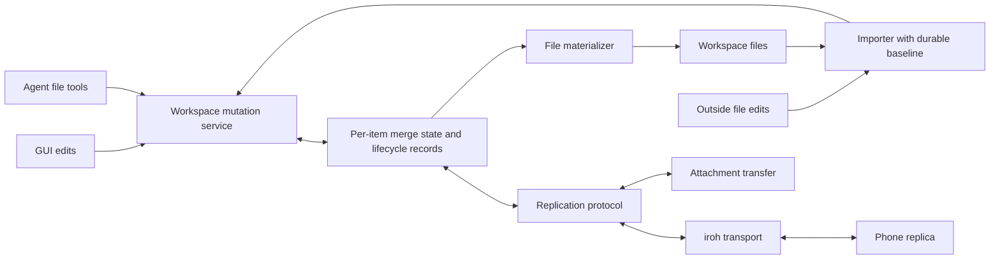

**Recommendation (inference): keep Jezo’s directory, introduce durable replication metadata inside it, and eventually sync logical items over iroh.** Use structured merging for fields, a text CRDT for prose, explicit deletion records, and separate protocols for sessions and attachments. Automerge 3 is my first implementation candidate; Loro deserves a comparison focused on history removal and mobile integration.

The most consequential decision is accepting that **the latest Markdown files cannot, by themselves, contain everything needed for reliable offline merging**. They omit deleted objects, causal relationships, and the editing history that distinguishes concurrent changes. The directory can remain the complete source of truth, but it must eventually include that metadata as first-class data.

**The 2026 landscape separates three problems: connecting devices, merging changes, and retaining data while devices are unavailable.** No single library below solves all three under Jezo’s constraints.

The findings below reflect documentation available on **2026-09-30**. “Verified” means supported by the linked source, not independently tested in Jezo. Suitability judgments and proposed behavior are marked **(inference)**.

**iroh is now a credible transport candidate, with qualifications.**

| Component | Verified behavior and maturity | Fit for Jezo (inference) |
|---|---|---|
| **iroh** | Rust networking library using authenticated, encrypted QUIC connections, direct connectivity attempts, and relay fallback. Version 1.0 was announced July 9, 2026. It is no longer the old all-in-one IPFS-like stack. [1.0 announcement](https://www.iroh.computer/blog/the-road-to-iroh-1-0) | Good transport beneath Jezo’s replication protocol. It does not decide how two todo edits merge. |
| **iroh-docs** | Replicates entries identified by namespace, author, and key. Values describe content hashes, lengths, and timestamps; content travels separately. It uses range-based set reconciliation and depends on blobs and gossip. [Repository](https://github.com/n0-computer/iroh-docs) | Useful replicated key-value infrastructure, but its “documents” are not text CRDT documents. Mapping one Markdown path to one value does not merge its contents. Different authors also create distinct entries unless the application defines how to combine them. |
| **iroh-blobs** | Content-addressed transfer with BLAKE3 verification and range requests. The current main-branch README explicitly says that version is not yet production quality and points production users to 0.35. [README](https://github.com/n0-computer/iroh-blobs) | Attractive for attachments and large snapshots. Check the exact release’s compatibility and maturity; do not assume iroh 1.0 makes every companion crate equally mature. |
| **iroh-gossip** | Topic-based message dissemination using epidemic broadcast trees, built over iroh. [README](https://github.com/n0-computer/iroh-gossip) | Optional change notifications. A few personal devices do not need a swarm, and notifications cannot replace durable catch-up after disconnection. |
| **Willow / iroh-willow** | Willow defines namespaces, subspaces, paths, timestamps, selective synchronization, capabilities, and prefix pruning. Its data model is marked final; Confidential Sync remains a proposal dated November 2025. `iroh-willow` describes itself as a minimal implementation. [Data model](https://willowprotocol.org/specs/data-model/), [Confidential Sync](https://willowprotocol.org/specs/confidential-sync/), [implementation](https://github.com/n0-computer/iroh-willow) | Worth watching for private selective replication. It does not supply Jezo’s text, todo, or forgetting semantics. Too much protocol surface to make a dependency today. |

**The language bindings exist; higher-level protocol coverage is the gap.**

The current official FFI repository publishes:

- Node.js: `@number0/iroh`.
- Swift: SwiftPM and CocoaPods, including Apple framework builds.
- Kotlin/JVM: `computer.iroh:iroh`, with Android build instructions.
- Python, plus community Go bindings.

Its documented scope is the stabilized iroh 1.0 transport: endpoints, connections, protocols, paths, tickets, and relays. **`iroh-docs`, `iroh-blobs`, and `iroh-gossip` are explicitly outside that binding scope.** [FFI repository](https://github.com/n0-computer/iroh-ffi), [support matrix](https://github.com/n0-computer/iroh-ffi/blob/main/support-matrix.yaml), [Android instructions](https://github.com/n0-computer/iroh-ffi/blob/main/README.kotlin.md)

For Electron, using the Node binding in the main process is plausible. For native mobile, Swift and Kotlin bindings provide a real starting point. **That is not evidence that Jezo’s packaged Electron build, suspend/resume behavior, or attachment stack will work without integration work (inference).**

**The relay arrangement fits the privacy constraint more readily than the cost/reliability constraint.**

Number0 runs free public relays. Its September 2026 announcement distinguishes a free, variably rate-limited Community service from paid shared and dedicated services. It states that relays do not store application data. Current documentation recommends public relays for development and testing, not production workloads. [September announcement](https://www.iroh.computer/blog/shared-relays), [relay guidance](https://github.com/n0-computer/docs.iroh.computer/blob/main/add-a-relay.mdx)

The connection remains end-to-end encrypted through a relay; the relay cannot read application payloads. However, endpoints, IP addresses, timing, traffic volume, and connection relationships are potential metadata exposure. Encryption does not provide anonymity. The project’s relay and authorization discussions distinguish transport authentication from application authorization. [Relay encryption](https://www.iroh.computer/blog/iroh-0-91-0-the-last-relay-break), [authorization discussion](https://github.com/n0-computer/iroh/discussions/3168)

For Jezo:

- **Encrypted forwarding relays are compatible with the stated privacy constraint**, if Tim accepts metadata exposure.
- Free public relays do **not** support a promise of dependable worldwide connectivity forever.
- A relay is **not a mailbox**. If the desktop is asleep when the phone is online, forwarding alone cannot deliver the desktop’s data.
- Asynchronous delivery without overlapping device availability requires another data-holding peer or encrypted storage somewhere.

That last point is a topology constraint, not something another CRDT can fix.

**Among merge libraries, Automerge and Loro are the strongest candidates for this particular application (inference).**

| Library | Verified capabilities and current position | Fit for Jezo (inference) |
|---|---|---|
| **Automerge 3 / automerge-repo** | Automerge 3 substantially reduced memory use while retaining the v2 storage format. The August 2026 update reports JS 3.4.1 and further storage improvements. Repo supplies document lifecycle, storage, and network adapters; a central server is optional. [Automerge 3](https://automerge.org/blog/automerge-3/), [August update](https://automerge.org/blog/2026-august/), [concepts](https://automerge.org/docs/reference/concepts/) | Best first candidate: established document model, retained conflicts, native Rust, JS, and an existing Swift ecosystem. Full history is a deletion concern, not merely a storage concern. |
| **Loro** | Rust, JS/WASM, and Swift; stable data format since 1.0; text, maps, lists, movable structures, versioning, and shallow snapshots. Maps use Lamport-ordered LWW semantics. [1.0](https://loro.dev/blog/v1.0), [map semantics](https://loro.dev/docs/tutorial/map) | Strong alternative, especially if bounded history is essential. Networking, persistence integration, and much of the application lifecycle remain Jezo’s responsibility. |
| **Yjs** | Mature shared text and structured types, provider ecosystem, offline persistence, idempotent updates, and selective undo scoped by transaction origin. [Offline support](https://docs.yjs.dev/getting-started/allowing-offline-editing), [updates](https://docs.yjs.dev/api/document-updates), [undo](https://docs.yjs.dev/api/undo-manager) | Excellent when a collaborative editor drives the design. Jezo’s harder problems are object lifecycle, external file edits, memory deletion, and heterogeneous plugins. Yjs can support them, but supplies less of the surrounding model. |

Two distinctions matter:

1. **CRDT map resolution is not necessarily wall-clock last-writer-wins.** Automerge preserves concurrent assignments and exposes them through `getConflicts`, while choosing a deterministic visible value. Loro’s LWW ordering uses logical timestamps. Neither automatically implements “whichever device’s clock says later.” [Automerge conflicts](https://automerge.org/automerge/api-docs/js/functions/getConflicts.html), [Loro maps](https://loro.dev/docs/tutorial/map)

2. **Compaction is not necessarily deletion.** Automerge repository compaction combines stored changes into snapshots; its document model retains history. Loro shallow snapshots can remove old history, but peers older than the retained frontier cannot synchronize normally. Yjs update merging alone does not garbage-collect deleted content. [Automerge storage](https://automerge.org/docs/reference/under-the-hood/storage/), [Loro shallow snapshots](https://loro.dev/docs/concepts/shallow_snapshots), [Yjs updates](https://docs.yjs.dev/api/document-updates)

Meaningful developments to watch in 2026:

- **Subduction** synchronizes partitioned, potentially encrypted CRDT data over pluggable transports, including iroh. It is an unusually close architectural match, but its README explicitly marks it an unstable preview unsuitable for production. [Repository](https://github.com/inkandswitch/subduction)
- **Keyhive / ARK** adds access control and end-to-end encryption to Automerge Repo. The August update still describes alpha integration. Useful research; unnecessary group-permission complexity for Jezo’s first single-owner implementation. [August update](https://automerge.org/blog/2026-august/)
- **LiveStore** is a newer event-sourced, reactive SQLite layer, currently presented as beta. It is relevant to the “operations are truth” option, rather than a drop-in text CRDT. [Project](https://livestore.dev/)
- **Teamtype**, formerly Ethersync, is the most directly relevant implementation precedent: local files, Automerge, iroh, and import of offline file edits. It remains a small project with acknowledged bugs and uses AGPL-3.0. Study its design rather than assuming it can simply be embedded in Jezo. [Repository](https://github.com/teamtype/teamtype), [offline import behavior](https://teamtype.github.io/teamtype/offline-support.html)

I found no basis for replacing these established candidates with a newly announced 2026 CRDT solely because it is newer.

**File synchronization remains useful, but its merge unit is wrong for Jezo’s structured data (inference).**

**Syncthing** provides mature peer-to-peer file replication, scanning, version tracking, block transfer, and conflict copies. Its **current v2 behavior allows a deletion to win**, retaining the edited version as a conflict copy; older documentation said edits always won. Conflict copies themselves propagate as ordinary files. [Current synchronization behavior](https://docs.syncthing.net/users/syncing.html), [v2 changes](https://github.com/syncthing/syncthing/blob/main/relnotes/v2.0.md)

Its relays forward encrypted traffic but can observe device IDs, addresses, and traffic volume. [Relay security](https://docs.syncthing.net/v1.28.0/users/relaying.html)

For Jezo, a conflict copy containing the same immutable entity ID becomes a duplicate entity, and a conflict copy containing forgotten memory violates the product’s intent. The official Android wrapper was also discontinued; mobile integration is not simply “ship Syncthing everywhere.” [Android releases](https://github.com/syncthing/syncthing-android/releases)

**Obsidian Sync** is more application-aware: Markdown conflicts use diff-match-patch, other files generally use last-modified-wins, and settings JSON gets key merging. Users can choose conflict files instead of automatic Markdown merging. This is not a general CRDT architecture. Its own documentation acknowledges duplicate text and formatting problems. [Conflict handling](https://obsidian.md/help/sync/troubleshoot)

Obsidian stores a remote vault on company-operated infrastructure, with end-to-end encryption enabled by default. Some routing/history metadata remains server-readable. It is a useful model for encrypted storage and visible recovery, but its paid hosted service does not meet Jezo’s infrastructure constraints. [Security model](https://obsidian.md/help/sync/security)

**Database sync systems fall into two different groups: embeddable replication mechanisms and applications built around an authoritative server.**

| System | Verified model | Fit for Jezo (inference) |
|---|---|---|
| **cr-sqlite** | SQLite extension exposing replicated relations and `crsql_changes`; transport-agnostic, with column-level replication metadata. Public releases remain pre-1.0. [Repository](https://github.com/vlcn-io/cr-sqlite), [releases](https://github.com/vlcn-io/cr-sqlite/releases) | Plausible for a particular SQLite plugin. It would require schema and native-extension commitments; it does not make arbitrary SQLite files safely mergeable. Do not select it without verifying present maintenance and supported platforms. |
| **SQLite session extension** | Captures row changes into changesets and supports conflict callbacks and inversion. Requires suitable primary keys; does not capture virtual tables. A session observes changes through one database connection. [Official introduction](https://www.sqlite.org/sessionintro.html) | Useful building block. It is not a complete distributed protocol or CRDT, and does not automatically capture a plugin’s writes through other connections. |
| **Evolu** | SQLite-oriented, end-to-end encrypted synchronization through relays; current protocol documentation describes direct P2P as future work. Current local-first docs retain deleted synchronized data and explicitly identify unimplemented purge APIs. [Protocol](https://www.evolu.dev/docs/api-reference/common/local-first/Protocol), [deletion and recovery](https://www.evolu.dev/docs/local-first) | Philosophically close on privacy. Current relay dependence, evolving APIs, and purge limitations make it a poor foundation for Jezo’s forgetting guarantee. |
| **ElectricSQL / PGlite** | Electric replicates Postgres data to clients. Writes use a separate application write path. PGlite is embedded Postgres/WASM and has an Electric sync integration. [Writes](https://electric-sql.com/docs/guides/writes), [PGlite sync](https://pglite.dev/docs/sync) | Good for apps with a Postgres backend. Does not provide autonomous desktop–phone peer replication under these constraints. |
| **PowerSync** | Client SQLite, an upload queue/application backend, a PowerSync service, and an authoritative source database. Broad client SDK coverage. [Architecture](https://docs.powersync.com/architecture/architecture-overview) | Strong infrastructure for offline clients of a backend. Wrong default topology for Jezo; self-hosting moves the operational burden rather than removing it. |
| **Jazz** | Version distinction is essential. **Classic Jazz** documents encrypted CoValues and cloud/self-hosted sync. Current newer documentation describes relational replicas, HLC field resolution, and a Core server that authorizes and durably accepts writes. [Classic encryption](https://classic.jazz.tools/docs/react/reference/encryption), [current sync model](https://jazz.tools/docs/concepts/how-sync-works), [server setup](https://jazz.tools/docs/getting-started/server-setup) | Do not transfer Classic’s E2EE promises to the newer architecture without verification. Neither is an obvious minimal fit for Jezo’s file interface and zero-infrastructure commitment. |
| **Triplit** | Full-stack database with property-level conflict resolution, offline operation, query subscriptions, pluggable storage, and server-enforced authorization. Repository is AGPL-3.0. [Repository](https://github.com/aspen-cloud/triplit) | Its server and database model would become major architectural commitments. Not a transport-neutral file-sync layer. |
| **Replicache** | Local optimistic mutations are replayed against canonical server state; pending mutations are rebased when updates arrive. [How it works](https://doc.replicache.dev/concepts/how-it-works) | Excellent reference for durable queues and idempotency, but requires an authoritative application backend. |
| **Zero** | Cloud `zero-cache` plus Postgres; current documentation explicitly rejects writes in disconnected/error states. [Architecture](https://zero.rocicorp.dev/), [offline behavior](https://zero.rocicorp.dev/docs/connection) | Fails the requested offline-writing requirement as currently documented. |
| **Ditto** | Commercial embedded synchronization with real offline mesh networking, including LAN, Bluetooth, and peer Wi-Fi. SDK use is licensed. [Mesh networking](https://www.ditto.com/solutions/peer-to-peer-mesh-networking), [license terms](https://www.ditto.com/legal/supplemental/license) | Technically relevant, especially on mobile. Commercial licensing and deployment terms prevent treating it as a free, open-source foundation. |
| **Anytype’s any-sync** | Open-source MIT protocol for encrypted peer synchronization; Anytype itself also supplies remote encrypted backup infrastructure. [Protocol](https://github.com/anyproto/any-sync), [license distinction](https://github.com/anyproto/legal-docs) | A serious precedent, but adopting its spaces, identity, storage, and Go-based stack would be a larger commitment than using iroh beneath Jezo’s own model. |

Docker is not the decisive issue for most rejected systems. Several can run without it. Their dependence on an operated backend, server authority, or commercial service is the more important mismatch.

**Comparable apps demonstrate useful patterns, but few meet all of Jezo’s constraints.**

| App | What is documented about its actual synchronization | Lesson for Jezo (inference) |
|---|---|---|
| **Obsidian** | Local files plus a hosted remote vault; text patch merging and file-specific conflict rules, described above. | Files can remain useful, but generic text merging does not understand todo fields or forgetting. |
| **Logseq DB** | The 2026 worker-sync rewrite uses database transactions, snapshots, E2EE, checksums, and rebase semantics. The repository includes Cloudflare and Node self-hosting implementations. May updates also introduced two-way Markdown mirroring. [March architecture update](https://discuss.logseq.com/t/logseq-db-changelog/30013/35), [server source](https://github.com/logseq/logseq/blob/master/deps/db-sync/README.md), [May update](https://discuss.logseq.com/t/whats-new-with-logseq-db-may-16th-2026/35020) | The relevant lesson is separating the synchronization model from the editable representation—not that Markdown inherently prevents sync. |
| **Anytype** | Local encrypted data, peer synchronization, and an encrypted remote backup node by default. Local-only mode disables the backup node and synchronizes over the same local network; that mode is marked experimental. [Sync](https://doc.anytype.io/anytype/data/sync-and-backup), [local-only](https://doc.anytype.io/anytype/data/sync-and-backup/local-only) | Availability and backup are separate benefits supplied by the remote peer. Removing it changes the user experience. |
| **Bear** | Uses CloudKit rather than synchronizing its database as a file. Supports Apple Advanced Data Protection; its privacy page separately notes title/tag encryption limitations. [Privacy and sync](https://bear.app/faq/syncing-privacy/) | Apple infrastructure can simplify native integration, but platform dependence and exact encryption coverage need scrutiny. |
| **Things** | Dedicated Things Cloud service, offline access, and encryption in transit and at rest. The cited documentation does not establish user-key E2EE or publish merge internals. [Things Cloud](https://culturedcode.com/things/support/articles/2803586/) | A polished experience supported by company-operated infrastructure, not evidence of a server-free design. |
| **Todoist** | Sync API uses incremental tokens, commands with UUIDs, and command deduplication. [API](https://developer.todoist.com/api/v1/) | Stable operation IDs and safe retry are directly useful. Its server API is not peer replication. |
| **Linear** | Local databases catch up from an immutable, ordered application-level action log using checkpoints. Its August 2026 article describes subscription filtering and server-side log storage. [Engineering article](https://linear.app/now/rebuilding-delta-sync-read-path) | Copy its distinction between durable changes and UI state. Do not copy a global server-assigned sequence into a peer-only system. |
| **Tana Outliner** | Desktop offline support arrived in November 2025: personal workspaces can be edited offline, shared workspaces are read-only offline, and changes synchronize on reconnect. [Announcement](https://outliner.tana.inc/blog/tana-desktop-now-works-offline-your-knowledge-graph-anywhere) | “Offline support” may cover a narrower set of operations than the product’s online behavior. Public documentation does not establish a reusable peer-sync engine. |
| **Capacities** | Downloads notes into local application storage, queues changes for cloud sync, and optionally downloads media. Server sync cannot be disabled; E2EE is not used. [Offline model](https://docs.capacities.io/misc/offline-support), [encryption](https://docs.capacities.io/faq/general/capacities-at-work) | All text plus selectable media is a sensible mobile storage policy. Its privacy/topology model does not fit. |
| **Reflect** | The original app has proprietary note/sync formats and E2EE. **Reflect Open**, announced July 2026, instead uses Markdown, rebuildable indexes, and iCloud/Git sync, with no added E2EE layer. [Announcement](https://reflect.app/blog/reflect-open) | A significant 2026 change. File ownership simplifies some things, but iCloud/Git do not establish Jezo’s desired merge or privacy semantics automatically. |
| **SilverBullet** | Offline browser copies synchronize with a file-backed server. Current collaboration documentation describes file watching and three-way merging, with visible conflicts; concurrent edits can suppress deletion. [Sync](https://v2.silverbullet.md/Sync), [collaboration](https://v2.silverbullet.md/Collaboration) | Strong reference for external edits and conflict UI. Its server and edit-preserving deletion rule need different choices in Jezo. |
| **Actual Budget** | Local data with a dedicated CRDT package and a sync server; optional E2EE makes the server unable to read budget contents. [Project structure](https://actualbudget.org/docs/contributing/project-details/), [encrypted sync](https://github.com/actualbudget/docs/blob/master/docs/getting-started/sync.md) | Particularly relevant for structured personal data. Encrypted storage can separate availability from trust, but someone still operates the server. |

**For Jezo, the synchronization unit should be an entity, not a pathname or an entire plugin directory (inference).** A todo, goal, note, or memory record is an independently identified object. Its body and fields have different merge rules. Attachments and session streams are different objects again.

The four proposed approaches compare as follows.

| Approach | How an outside edit enters sync | Deletion and undo | Principal cost |
|---|---|---|---|
| **Whole-file versions and conflict copies** | Scan file, hash bytes, create a new version associated with the known previous version. | Explicit deletion versions are still required. Undo creates another file version; conflict copies must be outside the active entity namespace. | Easy capture, poor semantic merging. Two harmless edits to different fields can conflict. |
| **Per-entity CRDT shadowing each file** | Parse the changed file; compare it with the last materialized version; turn differences into CRDT operations. | Entity deletion needs a separate lifecycle policy. Undo targets operations; deleting a file does not erase its CRDT history. | Durable CRDT state and careful reconciliation between bytes and logical state. |
| **Operation log as authority; files as projection** | An outside edit is imported as commands or operations. The projection is then regenerated. | Delete/restore/undo are explicit operations. Content removal requires retention or purge mechanisms beyond appending a delete. | Clean internal semantics, but a substantial change to the “agent works directly in files” contract. |
| **Hybrid: direct files plus captured operations** | App writes capture intent; external edits are diffed against a durable baseline and converted into the same changes. | Same explicit lifecycle and undo requirements as the CRDT/log approaches. | Best continuity with current Jezo, but cannot pretend its merge metadata is a disposable cache. |

An operation log alone does not guarantee convergence. Arrival-order replay of arbitrary commands can produce different results on different devices. It needs commutative operations, a defined rebase protocol, or deterministic causal resolution.

The remaining storage policies apply to **all four approaches**. Choosing whole-file synchronization does not remove the need for tombstones, identities, schema compatibility, or secret exclusion.

**External edits need a known base, and that base must survive restarts (inference).**

For each materialized item, retain:

- Stable entity ID and current path.
- Hash of the bytes last reconciled.
- The logical version or CRDT heads those bytes represent.
- Enough baseline content to calculate an edit against that version.
- Whether a projection write was pending when the process stopped.

A safe reconciliation sequence is:

1. Read local files before applying incoming remote changes.
2. Import changed bytes against their recorded base.
3. Merge incoming changes.
4. Validate the resulting entity.
5. Materialize the merged result and record its new base.

Suppose both devices start with a todo at 09:00. Offline, the phone marks it done, while the desktop agent moves it to 10:00. The desired result contains both changes. Replacing the whole file—or interpreting the desktop’s unchanged `state: open` as a fresh assignment—can reopen the task.

The importer must emit **only changed fields**. For prose, it should generate edits against the old text, rather than deleting and reinserting the whole body. Automerge explicitly documents that diffing whole strings is possible but merges less accurately than capturing input operations directly. [Text editing guidance](https://automerge.org/docs/reference/documents/text/)

There is an unavoidable limit: an external editor may hold an old buffer after Jezo updates the file. When that editor saves, a watcher cannot know whether removed remote text was an intentional deletion or stale-buffer overwrite. A CRDT cannot reconstruct information the editor never supplied.

Therefore:

- Jezo’s own GUI should carry the editing base or operation identity.
- Agent tools should use expected versions where available.
- External writes get best-effort import and recoverable conflict handling.
- Exact round-tripping of YAML comments and formatting should not become a cross-device convergence requirement.

Likewise, transient invalid YAML should remain visible as a file problem, not become destructive semantic operations. A missing directory after a failed scan must not become thousands of deletions.

**Frontmatter needs a small set of explicit merge policies (inference).**

Do not apply one rule indiscriminately:

| Data | Proposed rule |
|---|---|
| Independent scalar fields | Causal register; deterministic winner for concurrent assignments, retaining alternatives where useful. |
| Markdown body | Text CRDT. |
| Tags and similar membership | Set semantics if the plugin declares them; otherwise treat the value atomically. |
| Checklist steps | Stable IDs per step, field merging within a step, explicit ordering. |
| `scheduled` and `proposed` | One semantic group, so a new time cannot accidentally inherit acceptance of an older proposal. |
| Memory sentence and provenance | One semantic revision; avoid combining a sentence from one revision with evidence or confidence from another. |
| Plugin schema and executable configuration | Versioned artifacts, not arbitrary text that is automatically merged into a potentially invalid program. |

An atomic local transaction does not, by itself, preserve an invariant across concurrent transactions. Field grouping must be represented in the merge model.

For backlog ranks, deterministic tie-breaking by entity ID can make equal ranks display consistently, but it does not solve inserting between equal ranks. Choose a collision-tolerant ordering strategy before multi-device reordering ships.

**Deletion must distinguish absence, deletion, restoration, and forgetting (inference).**

A missing file could mean:

- It was deleted.
- It was renamed.
- Its plugin is not installed.
- This device has not downloaded it.
- Its attachment was evicted locally.
- The scan failed.

Only the first is an entity deletion.

For ordinary entities, retain a tombstone containing at least the entity ID, incarnation/generation, deletion operation ID, and causal context. An old file arriving later must not silently recreate the object. An explicit restore creates a new authorized lifecycle transition.

For **memory**, use a stronger rule:

1. Forgetting wins over concurrent edits to that memory.
2. Sync the forgetting record independently of the deleted content.
3. Apply forgetting records before exposing incoming memories to search or the agent.
4. Block both the old entity identity and the normalized-content fingerprint.
5. A restore must explicitly reference the forget event it reverses.
6. A concurrent or later forget that the restore did not observe remains effective.

A grow-only union of forget events is a good starting point; restoration records can acknowledge specific events. Physically removing a row from `forgotten.yaml` is not a distributed restoration protocol.

The current implementation has a concrete gap here. [`Memory.load()` and `current()`](/Users/tim/LocalData/coding/2026/Projects/12_jezo/Jezo/packages/pi-memory/src/memory.ts:130) load existing records and filter by status/expiry, but do not exclude records whose ID or fingerprint is in `forgotten`. A stale memory file copied back beside the tombstone can therefore become recallable. The tombstone check currently protects `remember()`, not every read path.

Also, normalized hashes only recognize equivalent wording under the normalization function. They cannot guarantee that a paraphrase of the same fact will never be inferred again. Reliable forgetting needs identity and provenance suppression as well as fingerprints; semantic equivalence remains a product limitation.

**Forgetting has a propagation guarantee and a retention guarantee; they are different (inference).**

The achievable propagation guarantee is:

> Once a device has received a forget record, ordinary sync, stale files, and ordinary undo cannot reactivate that memory.

An offline device cannot obey a deletion it has not received. Jezo should show that deletion is still pending on that device.

For retention, remove forgotten content from active files, CRDT payload/history, import baselines, search indexes, undo preimages, and app-managed snapshots according to the chosen policy. A tombstone may remain without retaining the sentence itself.

Do not expire tombstones merely because they are old. An old device or backup can return years later. At Jezo’s scale, keeping small tombstones indefinitely is simpler than proving distributed garbage collection safe. If history is truncated, old replicas need an explicit rebootstrap protocol; Loro’s documented shallow-snapshot limitation illustrates why. [Synchronization limits](https://loro.dev/docs/concepts/shallow_snapshots)

No protocol can erase an unavailable device or a user’s independent backup immediately.

**Undo should synchronize as a new action, not rewind another device’s state (inference).**

Two features should be distinguished:

- Undo a desktop agent run on the desktop, then synchronize the result.
- Open the phone and undo a run performed on the desktop.

The first should be supported from the beginning. The second requires replicating enough run metadata and before-state information, which is a separate retention decision.

For structured data, move toward undo identified by **entity, field/group, and original operation ID**. Comparing only values is insufficient: the user may have changed a value and then changed it back.

A particularly dangerous sequence is:

1. Agent changes a field.
2. Another device changes that field while offline.
3. The first device undoes the agent and broadcasts a new, later LWW assignment.

That “undo” can overwrite the user’s unseen edit. A local hash check cannot prevent it.

The eventual engine needs selective undo or deterministic conditional compensation evaluated against merged history. Preserve the identity of the operation being undone. Do not broadcast a blanket old snapshot with a fresh winning timestamp. Library undo managers are useful primitives, but they do not automatically implement Jezo’s “never undo the user” policy.

**IDs, ordering, and clocks serve different purposes (inference).**

Use separate identities for:

- Workspace.
- Entity.
- Device.
- Replica incarnation.
- Change/batch.
- Agent run.
- Session and session stream.

Use opaque, high-entropy IDs for newly created objects—for example `t-<UUIDv4>`. Existing IDs can remain valid; changing the generator does not require renaming old items.

Device identity belongs in per-device storage. Copying a workspace must not cause two devices to emit changes under the same replica actor and counter sequence. A restore or reinstall may need a fresh replica incarnation even if the user calls it the same device.

For merge ordering:

- Use CRDT causal heads/version vectors where the library already supplies them.
- Use operation IDs for deduplication.
- Use UTC instants for audit/display metadata.
- An HLC can provide a deterministic application ordering when required, but cannot establish which disconnected edit the person intended to win.
- Never use filesystem `mtime`, a local-minute string, or a UUID’s embedded time as the sole conflict resolver.

Keep scheduling semantics separate. “09:00 local time,” “09:00 America/Phoenix,” and an absolute instant are different domain values. Sync metadata must not force a silent reinterpretation of Jezo’s existing floating local times.

**Schema evolution needs to be part of the wire contract (inference).**

The protocol should distinguish:

- Replication protocol version.
- Plugin identity.
- Item format/schema version.
- Manifest revision.
- Required merge capabilities.

An older device should preserve unknown fields and data. It may display an item read-only or report that the plugin needs an update; it should not strip fields to satisfy an old validator.

A new manifest must not make old-but-valid offline operations silently disappear. Retain received data, distinguish unsupported versions from corrupt input, and apply compatible migrations deterministically. Concurrent manifest edits should preserve alternatives until a coherent revision is chosen.

This also means the latest plugin manifest cannot be the sole interpreter of every historical operation.

**Sessions, indexes, secrets, SQLite plugins, and attachments need separate policies (inference).**

| Data | Recommended treatment |
|---|---|
| **pi sessions** | Keep each physical stream single-writer. Replicate completed JSONL records or verified append chunks. Continuing on another device creates a linked session/fork rather than two devices appending to the same file. |
| **Habit/completion logs** | Immutable events with stable event IDs; union by ID. Prefer per-device streams over one multi-writer monthly file. Distinguish duplicate delivery from two genuinely separate events. |
| **Derived indexes** | Never sync FTS, embeddings, link indexes, caches, or local materialized query databases. Rebuild locally. |
| **Secrets** | Never include API keys, OAuth credentials, device private keys, or machine-bound `safeStorage` ciphertext in generic workspace sync. Provision sync keys through pairing; configure service credentials per device. |
| **SQLite-owned plugin data** | Plugin declares logical replication support or snapshot-only support. Never merge the live database file and WAL through ordinary file sync. |
| **Attachments** | Immutable content-addressed blobs, with logical attachment references stored in item data. Replacing an attachment creates a new blob/reference revision. |
| **Automations** | Sync definitions separately from execution ownership and run records. Receiving a definition or session must not replay its side effects. |
| **Skills and layouts** | Sync editable source/configuration with versions. Installation state, native binaries, permissions, and platform capabilities remain device-specific. |

The installed pi documentation confirms that sessions are trees using `id`/`parentId`, with versioned headers and automatic migration of older formats. They are not merely independent chat lines that can be concatenated arbitrarily. [Installed session format](/Users/tim/LocalData/coding/2026/Projects/12_jezo/Jezo/node_modules/@earendil-works/pi-coding-agent/docs/session-format.md)

Preserve pi’s internal identifiers and topology. Jezo can wrap a stream in its own globally unique identity without rewriting pi’s format. Receive into staging storage; do not replace a session file underneath a live `SessionManager`.

Memory evidence should move toward stable session/entry references. File paths and line numbers are fragile after transfer, branching, or format migration. Forgetting must also cover resumed model context and summaries, not just the agent’s file-read tool.

For SQLite plugins, the minimum future contract is: export changes, import idempotently, describe versions, enumerate referenced blobs, and process deletions. A plugin without that contract can still be local-only or synchronized as closed snapshots with conflicts. This preserves extensibility without falsely promising universal merge support.

**The phone should initially hold all small structured data and text, with selective large content (inference).**

That means all todos, goals, notes, memory control records, and relevant definitions; attachments and older sessions can be optional downloads.

This is simpler than query-based partial replication and better supports a person who opens the app unexpectedly without connectivity. It also gives the phone enough context to plan independently.

Represent these states explicitly:

- Known and downloaded.
- Known but not downloaded.
- Locally evicted.
- Deleted.

A missing attachment must never mean deleted. If subsets are introduced later, tombstones and required schema/lifecycle metadata must still reach every device that could hold affected content.

**The cheap decisions to make now are boundaries and identities, not an unfinished sync engine (inference).**

| Change to make now | Concrete repository location | Why it helps |
|---|---|---|
| Strengthen ID generation and keep IDs opaque | [`newId()`](/Users/tim/LocalData/coding/2026/Projects/12_jezo/Jezo/src/main/workspace/files.ts:32), `Memory.remember()` | Both currently use time plus three random bytes. Share a stronger strategy or inject the host’s ID generator into the standalone memory package. Keep old IDs accepted. |
| Give agent runs collision-resistant IDs | [`AgentHost.run()`](/Users/tim/LocalData/coding/2026/Projects/12_jezo/Jezo/src/main/agent/host.ts:181) | Run IDs currently contain only `Date.now()`. They will identify distributed history and undo. |
| Enforce immutable entity identity | [`Workspace.create()`, `update()`, `reread()`](/Users/tim/LocalData/coding/2026/Projects/12_jezo/Jezo/src/main/workspace/workspace.ts:130) | The documented invariant is stronger than the implementation: updates can supply `id`, and outside changes are interpreted as identity changes. Make identity change an explicit operation/problem. |
| Add stable IDs to independently editable children | [`todos/manifest.yaml`](/Users/tim/LocalData/coding/2026/Projects/12_jezo/Jezo/resources/workspace/todos/manifest.yaml) | Steps currently have only text and completion state. Identifying them by array position will make future offline merging harder. |
| Separate write preparation from committed changes | `Workspace.onWrite()`, `writeNow()`, `remove()`, `removeFile()` | `onWrite` runs before disk success. Keep a preparation hook for undo, but add a committed-change feed with identity, origin, before/after hashes, and batch ID. |
| Make the feed cover file-level changes, not only parsed items | `hint()`, `flush()`, `rescan()` | Current watching skips sessions, hidden paths, skills, and `forgotten.yaml`; rescans primarily cover item directories. UI notifications are not a complete replication feed. |
| Route undo through the mutation service | [`UndoLog.undo()`](/Users/tim/LocalData/coding/2026/Projects/12_jezo/Jezo/src/main/agent/undo.ts:102) | It currently calls `rm`/`writeAtomic` directly. Undo needs an explicit origin and must produce normal syncable changes without recursively recording itself as another agent run. |
| Make forgetting effective on reads and reloads | [`Memory.load()`, `current()`, `forget()`, `restore()`](/Users/tim/LocalData/coding/2026/Projects/12_jezo/Jezo/packages/pi-memory/src/memory.ts:130), [`createMemory()`](/Users/tim/LocalData/coding/2026/Projects/12_jezo/Jezo/src/main/agent/memory.ts:24) | Enforce tombstones during recall/context construction and respond when only the forgetting ledger changes. Model restore intent separately from ordinary file restoration. |
| Carry optimistic concurrency through the GUI contract | [`serveWorkspace()`](/Users/tim/LocalData/coding/2026/Projects/12_jezo/Jezo/src/main/workspace/ipc.ts:11), [`renderer updates`](/Users/tim/LocalData/coding/2026/Projects/12_jezo/Jezo/src/renderer/src/data/store.ts:260) | `Workspace.update()` supports an optional hash, but the inspected renderer paths do not supply it. Hash checking is not currently universal. |
| Reserve workspace/plugin format versions and replication classification | `loadKinds()`, [`schema.ts`](/Users/tim/LocalData/coding/2026/Projects/12_jezo/Jezo/src/main/workspace/schema.ts), manifests | Distinguish replicated source, derived data, device-local data, and opaque plugin-owned stores. |
| Distinguish new-workspace seeding from joining an existing workspace | [`seedWorkspace()`](/Users/tim/LocalData/coding/2026/Projects/12_jezo/Jezo/src/main/workspace/seed.ts:22) | A joining phone must not recreate defaults that the user deleted elsewhere. |
| Give automation execution an explicit owner | [`Schedule.tick()`](/Users/tim/LocalData/coding/2026/Projects/12_jezo/Jezo/src/main/agent/schedule.ts:57) | Current deduplication consults local session history. Two disconnected devices could both run the morning plan. Start with one nominated executor. |

Three additional observations from the current code matter:

- `writeAtomic()` provides temp-file-and-rename replacement, but it is not a transaction spanning a file and replication metadata. A future journal needs crash recovery.
- A hash check followed by rename is not an atomic compare-and-swap against arbitrary external writers.
- Body links currently resolve by file path in `withLinks()`. Immutable frontmatter IDs alone do not make body links survive renames. Keep canonical ID filenames or define a semantic rename/link policy.

The undo design document mentions before/after shell snapshots, but the inspected `UndoLog` records `Workspace.onWrite` events; current agent tools do not enable bash. When shell access arrives, observed filesystem changes must not automatically be attributed to the agent simply because they happened during its run.

**Do not add per-field wall-clock timestamps everywhere now (inference).** They create format noise, external editors will not maintain them, and they cannot recover lost causal history. Preserve mutation intent in the service interface; add the selected replication engine’s metadata when implementing sync.

Similarly, a workspace ID and format version are cheap to introduce now. A device/replica identity is essential before emitting replicated operations, but there is little value in inventing the entire device registry before pairing exists.

What can wait:

- CRDT dependency selection and storage implementation.
- HLC implementation, if the final model needs one.
- Transport framing and network discovery.
- Durable outbox and synchronization acknowledgements.
- Attachment transfer optimization.
- Mobile selective replication.
- Cross-device initiation of undo.
- Tombstone garbage collection.
- General plugin replication SDK.
- Encrypted third-party storage adapters.

**“Without migrations” should mean avoiding disruptive identity and data-model migrations, not promising zero initialization work (inference).** Sync enrollment can read existing items and create one shared replication baseline without changing their IDs or Markdown format. Devices must receive that baseline; independently constructing unrelated CRDT histories from identical files is unsafe.

Existing field history cannot be reconstructed retroactively. There is also no need to retain ordinary pre-sync deletions forever when no remote replica ever received those objects.

**The eventual architecture I recommend is a hybrid with one replication document per logical item (inference).**

I would make these choices:

1. **Automerge 3 for the first structured-document implementation.** One document per item, body as collaborative text, ordinary fields as explicitly modeled registers/groups. Preserve concurrent alternatives for important scalar conflicts. Its Swift library and Repo interoperability are useful for a macOS/iPhone path. [Swift bindings](https://github.com/automerge/automerge-swift)

2. **Durable replication state inside the workspace.** For example, a reserved `.jezo/replication/` area with documented format and GUI diagnostics. This state is part of the workspace backup contract. Search indexes remain disposable and separate.

3. **Files remain an accepted editing surface.** GUI operations preserve intent; agent/editor writes import through the same semantic layer. A stale file never silently replaces a newer replication document.

4. **Deletion control is separate from content documents.** Forgetting can retire and purge an entire memory document while preserving its minimal suppression record. This is one reason to avoid one enormous CRDT containing every memory and note.

5. **iroh transports replication messages between paired devices.** Pair through a QR code or comparable authenticated exchange. Check workspace membership before serving data. Knowing an endpoint ID or content hash is not authorization.

6. **Use point-to-point catch-up first.** Exchange workspace identity, capabilities, deletion/control state, item versions, and missing changes. Acknowledge only durable receipt. Deduplicate every retry. Gossip can wait.

7. **Keep the first attachment implementation replaceable.** Use authenticated, resumable transfer; adopt `iroh-blobs` when its chosen release and bindings are proven for the target platforms.

8. **Sync definitions without duplicating execution.** One device owns scheduled agent work initially. A synchronized operation describes a result; receiving it never re-executes an external action.

This preserves the directory principle, but revises the stronger claim that every non-text representation is rebuildable. Losing replication metadata would leave readable content, yet not enough information to resume the same replication history safely. Recovery should explicitly create or rejoin an epoch rather than inventing old causality.

If Tim insists that deleting all sidecars must preserve full future merging behavior, I would choose whole-file versioning with visible conflicts instead. That is a coherent tradeoff, but materially weaker synchronization.

**If iroh integration is not ready, keep the same data protocol and change the transport (inference).**

The fallback order should be:

1. Bundle a small Rust helper in Electron, communicating over local IPC. On mobile, use an embedded native library; do not assume a desktop-style sidecar process is available.
2. Ship authenticated LAN synchronization and encrypted export/import bundles.
3. Add optional user-selected encrypted storage only if Tim approves that product model.

WebRTC is not a free escape hatch: it still needs signaling and often TURN infrastructure. CloudKit is a different platform and storage commitment. Syncthing does not replace semantic replication.

Public iroh relays can support experimentation and best-effort connectivity, but the product must remain usable when they are unavailable. The current zero-paid-infrastructure requirement means accepting that limitation unless an independent, sustainable relay arrangement emerges.

**The largest risks are semantic correctness, forgetting, and device availability—not bandwidth (inference).**

The first implementation should be judged against a real two-device scenario, not a text editor demo:

- Disconnect devices.
- Edit different fields and overlapping body text.
- Delete a memory while the other device modifies or restores it.
- Undo an agent change while the other device has an unseen user edit.
- Restart during file materialization.
- Reconnect with reordered and duplicated messages.
- Repeat with one older schema version.
- Confirm convergence, preservation of user changes, and absence of forgotten content from recall and retained payloads.

Every run should retain the two workspaces, relevant replication metadata, and a replayable event trace, matching Jezo’s existing E2E artifact requirement.

Mobile background execution is a separate constraint. iOS normally suspends background apps; newer continued-processing APIs permit particular user-initiated work, not an unrestricted permanent peer daemon. **“It syncs when opened and opportunistically in the background” is a defensible initial promise; “always synchronized before opening” is not.** [Apple lifecycle guidance](https://developer.apple.com/documentation/uikit/preparing-your-ui-to-run-in-the-background), [continued processing](https://developer.apple.com/documentation/BackgroundTasks/performing-long-running-tasks-on-ios-and-ipados)

**The questions only Tim can settle are these:**

1. **Must devices synchronize without ever being online together?** If yes, some third device or encrypted storage must retain data between connections. A forwarding relay cannot do it.

2. **Does “no paid infrastructure” forbid only project spending, or also optional use of storage the user already owns?** This determines whether encrypted user-selected storage is an acceptable availability option.

3. **Can the workspace contain essential replication metadata that cannot be rebuilt from current Markdown?** This decides between reliable semantic merging and simpler file conflict handling.

4. **What exactly does “forget” promise?** Stop recall immediately on informed devices; purge all Jezo-managed history; or erase the underlying conversations too? These require different retention and recovery behavior.

5. **Must the phone run its own agent and automations offline, or primarily capture and edit data?** Independent agent execution increases duplicate-work, model, credential, and context requirements.

6. **Must undo be available from any device?** Synchronizing an undo result is straightforward compared with synchronizing the private, short-lived history needed to initiate that undo elsewhere.

7. **When two devices change the same important field, should Jezo choose a deterministic result quietly or retain a visible decision for the user?** My default is automatic merging of independent edits, with a small, nonblocking review surface for genuinely competing decisions.

8. **How long may a device remain absent and still merge its old edits automatically?** Indefinite absence favors permanent lifecycle tombstones and conservative history retention; bounded absence permits more aggressive compaction and explicit rebootstrap.
