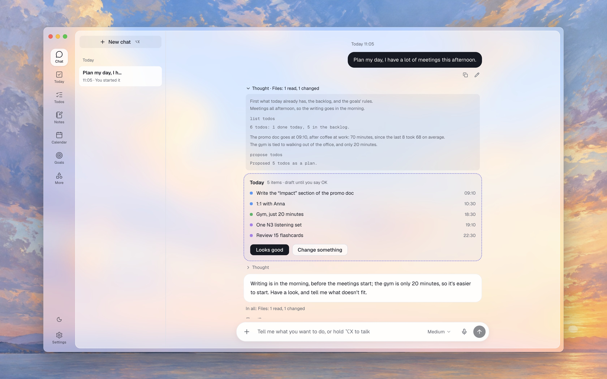
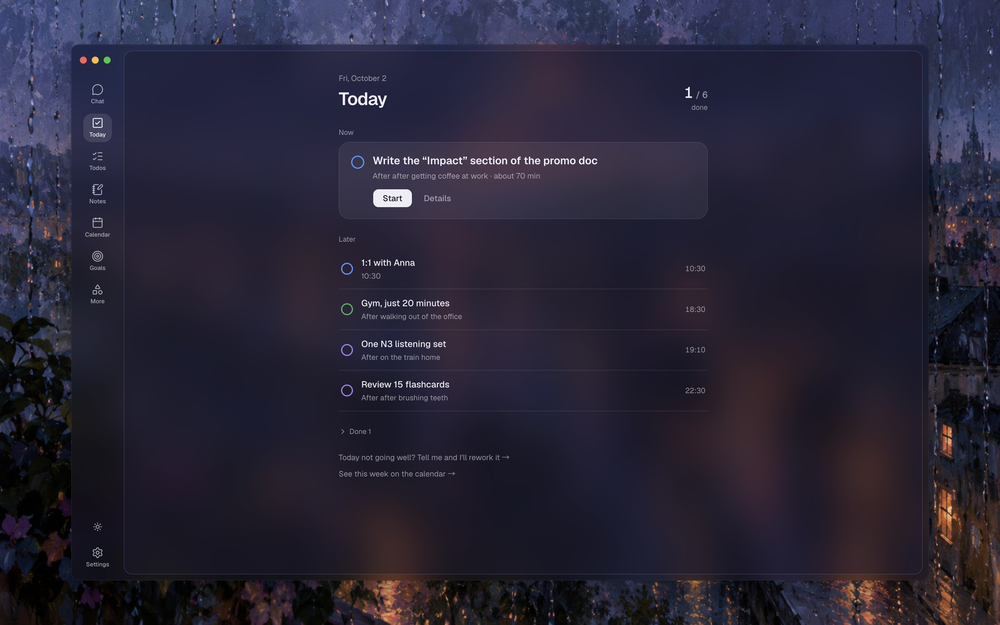
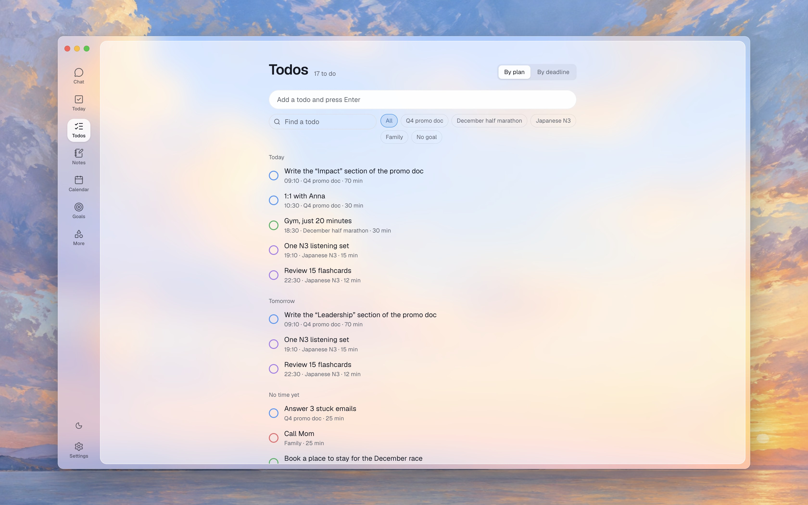
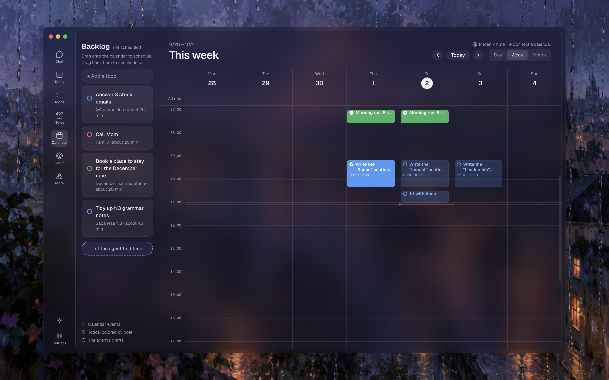

<p align="center"></p>

<h1 align="center">Jezo</h1>

<p align="center">A local-first personal agent that helps turn your goals into plans and follow-through so you can focus on the present.</p>

<p align="center">English · <a href="README.zh-CN.md">简体中文</a></p>

The name comes from 節奏 (jiézòu), Chinese for rhythm.

You set the direction. Jezo's agent plans your days, keeps the list current and follows up. You do the work.

Jezo is built for people with ADHD who have given up on todo app after todo app. Those apps didn't fail on features. They failed because gathering context and keeping the list current took more energy than the tasks did, and after a week away the list was stale. Jezo's agent does that upkeep. Your data stays on your computer, in plain files you can read, back up, move and delete.

<p align="center"></p>

## What it does

- **Plans with you, not for you.** Ask it to plan tomorrow, or say today went badly. It proposes a plan as drafts, and nothing counts until you accept it. Its thinking and the files it read are folded under each answer.
- **Today** shows what's now, what's next, and what's due.
- **Todos** have a time, a deadline, the situation you'll do them in (“after getting coffee at work”), steps, notes and attachments. They can repeat. Deadlines get a reminder.
- **Calendar.** Your Mac's calendars, Google Calendar with your own client, and any ICS feed sit next to your todos. Drag a todo onto the week to schedule it. Jezo only reads your calendars.
- **Goals** break down into if-then rules, and the agent watches which rules actually work for you.
- **Notes and ⌥X.** Press ⌥X anywhere to ask Jezo something or jot a note. Hold it to talk instead. Notes are sorted into todos, goals and things to remember when you hand them over.
- **Routines.** A morning plan, an evening check-in and a weekly review run on their own, and you can add your own. Ones that were missed while your computer slept are caught up.
- **Experiments.** Want to know if doing the hardest thing first helps? Jezo can run an A/B over a few weeks and tell you what your own data says.
- **Memory.** It remembers what you tell it, and forgets what you delete.
- **Undo.** Every change the agent makes is listed in **Change history**, and can be taken back.
- **Your methods, not ours.** Every planning method is a skill you can turn off, edit or replace, and Jezo can install skills, MCP servers and pi packages.

<p align="center">
  
  
</p>
<p align="center"></p>

The app is in English, Simplified Chinese and Traditional Chinese, and follows your system's language.

## Install

Jezo runs on Macs with Apple silicon.

1. Download the `.dmg` from [Releases](../../releases) and drag Jezo into Applications.
2. Jezo isn't signed yet, so macOS refuses the first time you open it. Open **System Settings → Privacy & Security**, scroll down to the line about Jezo, and click **Open Anyway**.
3. Pick a model. If [LM Studio](https://lmstudio.ai) or [Ollama](https://ollama.com) is running, Jezo finds it on its own. Or add a key for Anthropic, OpenAI, Google, OpenRouter or another provider in **Settings → Model providers**.
4. For talking instead of typing, click **Install** under **Speech recognition** in Settings. It downloads a small speech model that runs on your Mac.

Your data is in `~/Jezo`: markdown files, one per todo, goal and note. Keys go to the macOS keychain.

## Development

Needs [Bun](https://bun.sh), Node 26, and Xcode Command Line Tools (for the native helpers: the ⌥X key, the Mac's calendars and Apple's on-device model).

```sh
bun install
bun run dev        # the app, with hot reload
bun run typecheck
bun run test       # unit tests
bun run e2e        # end-to-end tests in the built app
bun run package    # an unsigned app in dist/
```

The end-to-end tests run the real app against a throwaway workspace. The ones that talk to a model need LM Studio with `qwen3.6-35b-a3b-splash` (set `JEZO_TEST_MODEL` to use another) and skip themselves when no local model server is running. The ones tagged `@speech` need speech recognition installed. CI runs everything else.

The pictures above come from `node scripts/screenshots.ts`, run after `bun run build`: for each language it takes each one from the built app on the same sample workspace the tests use, written in that language, and lays the see-through window over a painting in `docs/screenshots/backdrops/`. A new picture is one entry in the script.

## How it's built

- [AGENTS.md](AGENTS.md): the principles and the trust model. Start here.
- [docs/design/](docs/design/): every decision, why, and what was turned down. [backend.md](docs/design/backend.md) and [frontend.md](docs/design/frontend.md) are the main ones.

Jezo is an Electron app. Its agent is [pi](https://github.com/earendil-works/pi), running in the main process, with the workspace folder as its working directory: it reads and changes your data with files and tools, like a coding agent. The interface is React with [assistant-ui](https://www.assistant-ui.com) for the chat.

## License

[Apache-2.0](LICENSE)
