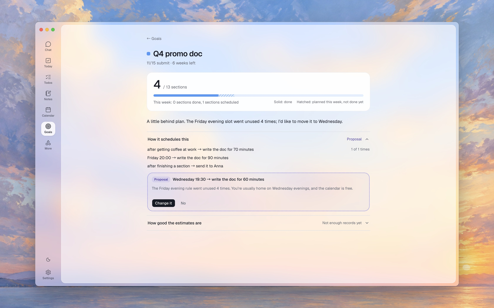
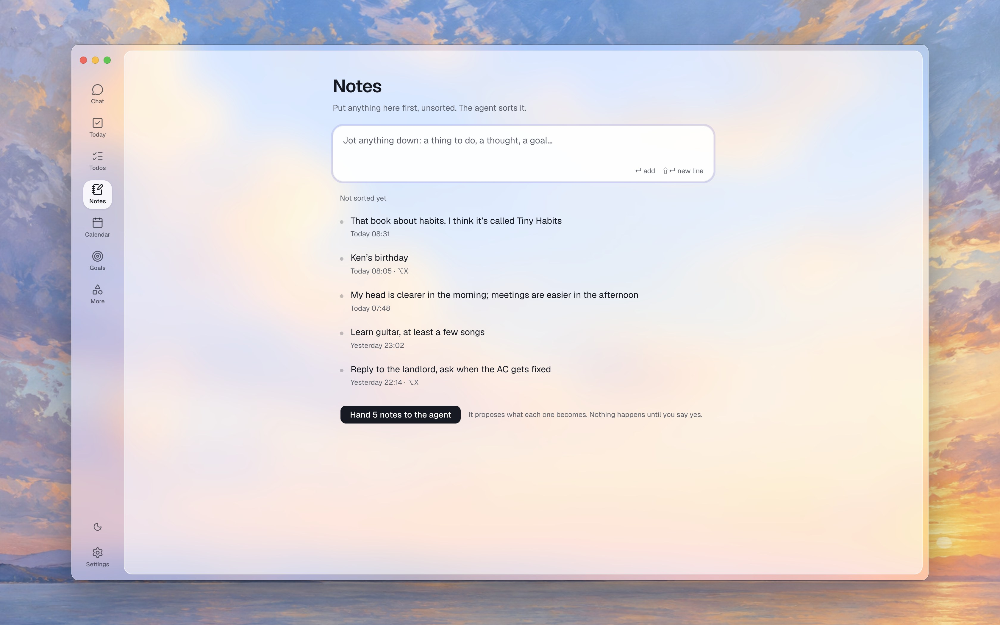
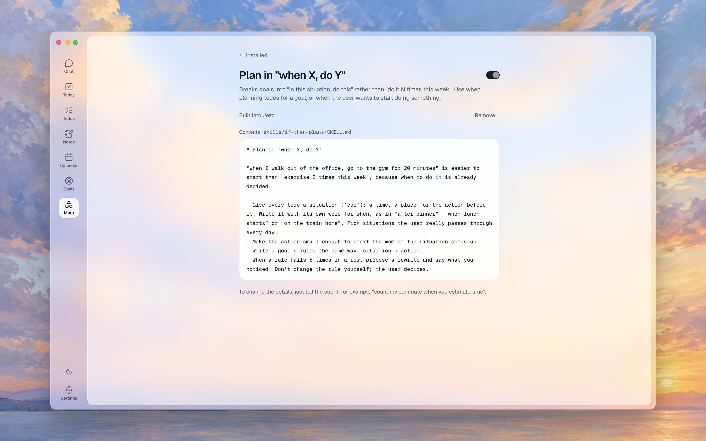
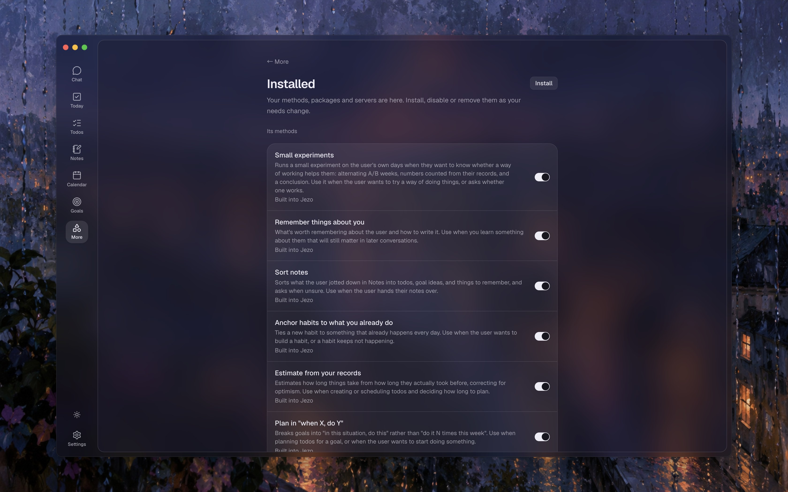
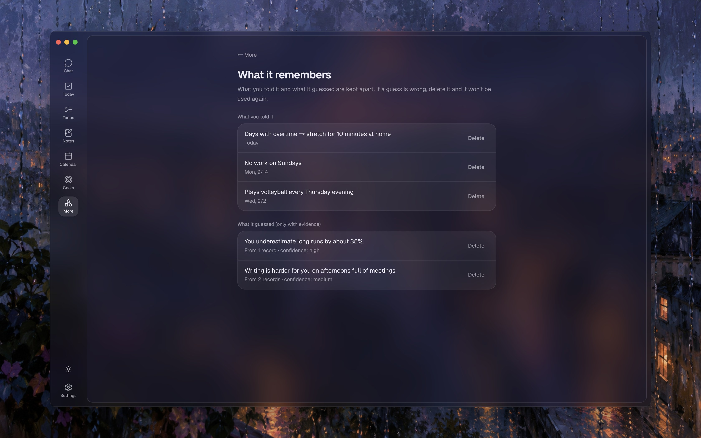
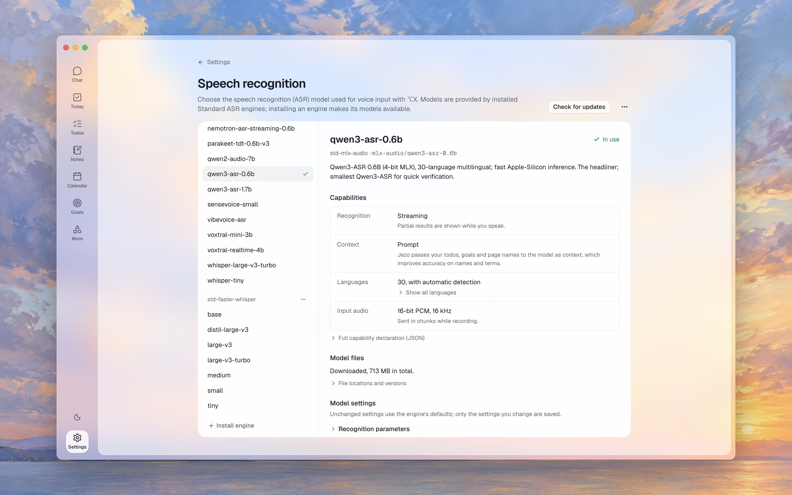

<p align="center"></p>

<h1 align="center">Jezo</h1>

<p align="center">A local-first personal agent that helps turn your goals into plans and follow-through so you can focus on the present.</p>

<p align="center">English · <a href="README.zh-CN.md">简体中文</a></p>

The name comes from 節奏 (jiézòu), Chinese for rhythm.

You set the direction. Jezo's agent plans your days, keeps the list current and follows up. You do the work.

Jezo's agent is [pi](https://github.com/earendil-works/pi), a full open-source coding agent, working in your workspace instead of a code repository. It can do anything pi can, and it grows with the skills, MCP servers and pi extensions you add: connect your email, a browser or any other source, and the more of your life it can see, the less you have to explain ([Built on pi](#built-on-pi)). Your data stays on your computer, in plain files you can read, back up, move and delete.

<p align="center"></p>

## What it does

- **Plans with you, not for you.** Ask it to plan tomorrow, or say today went badly. It proposes a plan as drafts, and nothing counts until you accept it. Its thinking and the files it read are folded under each answer.
- **Today** shows what's now, what's next, and what's due.
- **Todos** have a time, a deadline, the situation you'll do them in (“after getting coffee at work”), steps, notes and attachments. They can repeat. Deadlines get a reminder.
- **Calendar.** Your Mac's calendars, Google Calendar with your own client, and any ICS feed sit next to your todos. Drag a todo onto the week to schedule it. Jezo only reads your calendars.
- **Goals** break down into if-then rules, and the agent watches which rules actually work for you. When one keeps not happening, it proposes a better one.
- **Notes and ⌥X.** Press ⌥X anywhere to ask Jezo something or jot a note. Hold it to talk instead. Notes are sorted into todos, goals and things to remember when you hand them over.
- **Routines.** A morning plan, an evening check-in and a weekly review run on their own, and you can add your own. Ones that were missed while your computer slept are caught up.
- **Experiments.** Want to know if doing the hardest thing first helps? Jezo can run an A/B over a few weeks and tell you what your own data says.
- **Memory.** It remembers what you tell it, and forgets what you delete.
- **Undo.** Every change the agent makes is listed in **Change history**, and can be taken back.

<table>
  <tr>
    <td width="50%" valign="top">
      <a href="docs/screenshots/en/today.jpg"></a>
      <br><b>Today</b> · what's now, and what's later, once you've accepted the plan.
    </td>
    <td width="50%" valign="top">
      <a href="docs/screenshots/en/todos.jpg"></a>
      <br><b>Todos</b> · grouped by when they're planned. Open one to see why the agent put it there, and its steps.
    </td>
  </tr>
  <tr>
    <td width="50%" valign="top">
      <a href="docs/screenshots/en/calendar.jpg"></a>
      <br><b>Calendar</b> · the week, with the agent's drafts dashed and the backlog beside it to drag in.
    </td>
    <td width="50%" valign="top">
      <a href="docs/screenshots/en/goal.jpg"></a>
      <br><b>Goals</b> · its rules, and the agent proposing to move the one that went unused.
    </td>
  </tr>
  <tr>
    <td width="50%" valign="top">
      <a href="docs/screenshots/en/notes.jpg"></a>
      <br><b>Notes</b> · jotted down unsorted, then handed to the agent to sort.
    </td>
    <td width="50%" valign="top">
      <a href="docs/screenshots/en/skill.jpg"></a>
      <br><b>A method</b> · a skill is a file you can read, turn off, or ask the agent to change.
    </td>
  </tr>
  <tr>
    <td width="50%" valign="top">
      <a href="docs/screenshots/en/installed.jpg"></a>
      <br><b>Installed</b> · every method, pi package and MCP server, each one with a switch. In the dark theme.
    </td>
    <td width="50%" valign="top">
      <a href="docs/screenshots/en/memory.jpg"></a>
      <br><b>Memory</b> · what you told it, kept apart from what it guessed and why. In the dark theme.
    </td>
  </tr>
</table>

The app is in English, Simplified Chinese and Traditional Chinese, and follows your system's language. It comes in a light and a dark theme.

## Speech recognition

Hold ⌥X, or click **Talk** in the chat, and say it instead of typing. Recognition runs on your Mac through [Standard ASR](https://github.com/standard-voice/standard_asr), the open standard between apps and speech recognition engines. One click in **Settings → Speech recognition** installs Qwen3-ASR 0.6B on Apple's MLX: it knows 30 languages and shows the words while you speak.

Any engine that speaks Standard ASR works the same way. Install it by its package name, Git address or folder, and its models join the list, with no code in Jezo for it. Each model shows what it can do in the field's own terms (streaming or batch, prompt and phrase hints, languages, input audio), whether its files are downloaded, and every setting its engine has. Jezo tells the model what you're likely to say, from your todos, goals and the app's page names, so names come out right.

<p align="center"></p>

## Built on pi

Jezo's agent is pi with nothing taken out. It runs in your workspace folder with the tools it has in a code repository: it reads and edits files, runs commands, and checks its own work. Whatever extends pi extends Jezo.

- **Skills.** Every planning method Jezo comes with is a skill you can turn off, edit or replace. Install others, or ask Jezo to write one.
- **MCP servers.** Connect your email, a browser for Jezo to use (Playwright's MCP server, for one), your notes, or any other service that has an MCP server. Jezo reads from it and acts through it.
- **pi packages and extensions**, from npm or GitHub.

To add one, paste its GitHub address, `npm:` name, MCP URL or MCP JSON into the chat. What's installed is listed under **More → Installed**, where you can turn it off or remove it. Your Mac's calendars, Google Calendar and ICS feeds are built in.

Text other people wrote, like email, web pages and calendar invites, comes in marked as outside content and is checked on the way in. Jezo treats it as information for you, never as instructions.

## Privacy

Jezo has no telemetry, and we don't collect anything about you. pi's own telemetry is turned off too. Nothing leaves your computer unless you set up something that goes online:

- a model provider in the cloud, such as Anthropic or OpenAI, which gets what the agent sends it. A local model in LM Studio or Ollama stays on your computer.
- a skill, MCP server or pi extension that reaches the internet, and installing one from GitHub or npm.
- Google Calendar or an ICS feed, which Jezo downloads your events from.
- speech recognition, which downloads its packages and model when you install it, and when Jezo updates them. What you say is recognized on your computer.

## Install

Jezo runs on Macs with Apple silicon.

1. Download the `.dmg` from [Releases](../../releases) and drag Jezo into Applications.
2. Jezo isn't signed yet, so macOS refuses the first time you open it. Open **System Settings → Privacy & Security**, scroll down to the line about Jezo, and click **Open Anyway**.
3. Pick a model. If [LM Studio](https://lmstudio.ai) or [Ollama](https://ollama.com) is running, Jezo finds it on its own. Or add a key for Anthropic, OpenAI, Google, OpenRouter or another provider in **Settings → Model providers**.
4. For talking instead of typing, click **Install** under **Speech recognition** in Settings. It sets up Standard ASR with Qwen3-ASR 0.6B, which runs on your Mac.

Your data is in `~/Jezo`: markdown files, one per todo, goal and note. Keys go to the macOS keychain.

## Development

Needs [Bun](https://bun.sh), Node 26, and Xcode Command Line Tools (for the native helpers: the ⌥X key, the Mac's calendars and Apple's on-device model).

```sh
bun install
bun run dev        # the app, with hot reload
bun run typecheck
bun run test       # unit tests
bun run e2e        # end-to-end tests in the built app
bun run package    # an unsigned app in dist/
```

The end-to-end tests run the real app against a throwaway workspace. The ones that talk to a model need LM Studio with `qwen3.6-35b-a3b-splash` (set `JEZO_TEST_MODEL` to use another) and skip themselves when no local model server is running. The ones tagged `@speech` need speech recognition installed. CI runs everything else.

The pictures above come from `node scripts/screenshots.ts`, run after `bun run build`: for each language it takes each one from the built app on the same sample workspace the tests use, written in that language, and lays the see-through window over a painting in `docs/screenshots/backdrops/`. The speech recognition picture borrows the speech recognition installed in your own Jezo, and is skipped without one. A new picture is one entry in the script.

## How it's built

- [AGENTS.md](AGENTS.md): the principles and the trust model. Start here.
- [docs/design/](docs/design/): every decision, why, and what was turned down. [backend.md](docs/design/backend.md) and [frontend.md](docs/design/frontend.md) are the main ones.

Jezo is an Electron app. Its agent is [pi](https://github.com/earendil-works/pi), running in the main process, with the workspace folder as its working directory: it reads and changes your data with files and tools, like a coding agent. The interface is React with [assistant-ui](https://www.assistant-ui.com) for the chat.

## License

[Apache-2.0](LICENSE)
