<p align="center">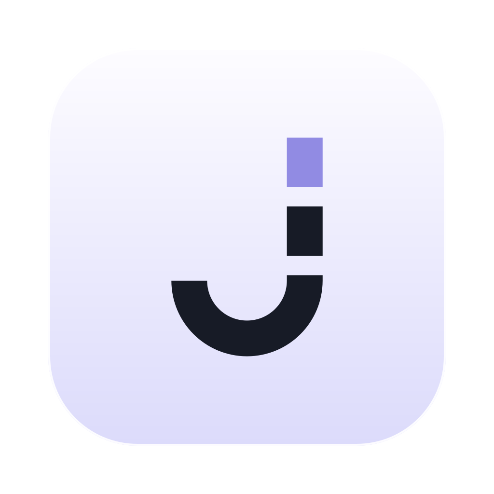</p>

<h1 align="center">Jezo</h1>

<p align="center">本地优先的个人 agent，帮你把目标变成计划，再一件件跟进，让你专注在当下。</p>

<p align="center"><a href="README.md">English</a> · 简体中文</p>

名字来自「节奏」（jiézòu）。

方向你来定。Jezo 的 agent 帮你排好每一天、让清单保持最新、到时候提醒你跟进。事情由你来做。

Jezo 的 agent 是 [pi](https://github.com/earendil-works/pi)，一个完整的开源编程 agent，只是工作的地方从代码仓库换成了你的工作区。pi 能做的它都能做，而且会随着你装的 skill、MCP 服务器和 pi 扩展长出新本事：接上你的邮箱、浏览器或其他数据来源，它看到的你的生活越多，你要解释的就越少（见[基于 pi](#基于-pi)）。你的数据留在你自己的电脑上，是看得懂的普通文件，可以自己备份、搬走、删除。

<p align="center">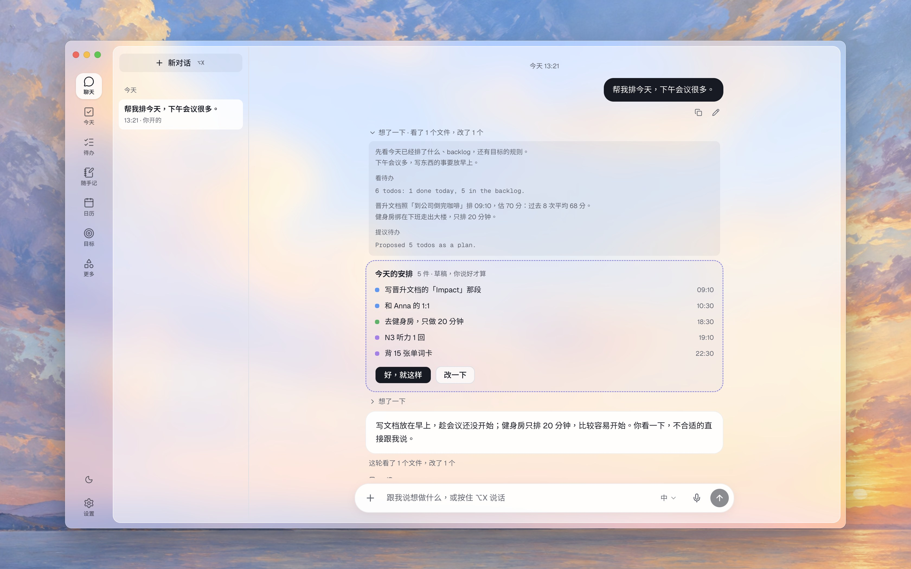</p>

## 能做什么

- **跟你一起排，而不是替你决定。** 让它帮你排明天，或者跟它说今天不太顺。它提议的计划都是草稿，你说好了才算。它想了什么、看了哪些文件，都收在每个回答下面。
- **今天**：现在该做什么、接下来做什么、哪些快截止了。
- **待办** 有时间、截止日、在什么情境下做（「到公司倒完咖啡之后」）、步骤、笔记和附件。可以设成重复，截止前会提醒。
- **日历。** 这台 Mac 的日历、用你自己的客户端连接的 Google 日历，还有任何 ICS 订阅，都和待办放在一起。把待办拖到这周的某个时间就排好了。Jezo 只读，不会改你的日历。
- **目标** 拆成「在什么情境下做什么」的规则，agent 会看哪些规则对你真的有用。哪条一直没做成，它会提议换一条。
- **随手记和 ⌥X。** 在任何地方按 ⌥X，问 Jezo 一个问题或记一笔；按住就能语音输入。随手记交给 agent 后，它会提议每一条变成待办、目标还是要记住的事。
- **自动化。** 早上安排、晚上 check-in、每周回顾会自己开始，你也可以加自己的。电脑睡着时错过的，醒来会补上。
- **小实验。** 想知道「早上先做最难的事」对你有没有用？Jezo 可以用几周时间做 A/B 对比，告诉你你自己的记录怎么说。
- **记忆。** 记住你说过的事，你删掉的就忘掉。
- **撤销。** agent 做的每个改动都列在「修改记录」里，都能撤销。

<table>
  <tr>
    <td width="50%" valign="top">
      <a href="docs/screenshots/zh-CN/today.jpg">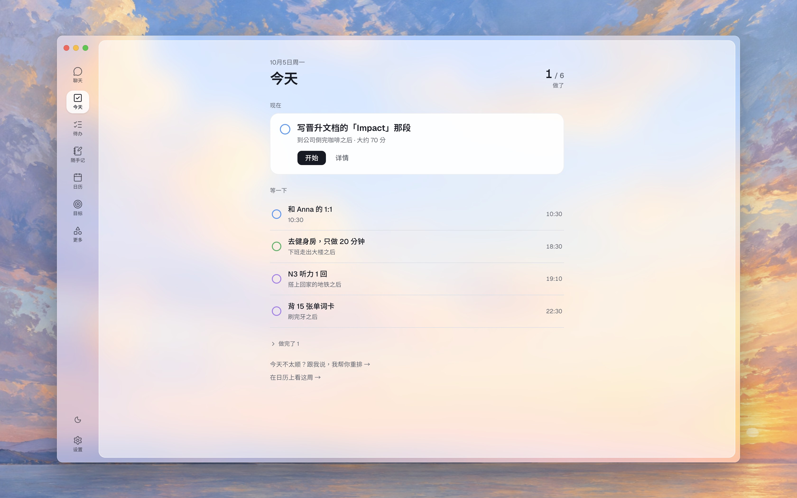</a>
      <br><b>今天</b> · 确认计划之后：现在要做的，和等一下的。
    </td>
    <td width="50%" valign="top">
      <a href="docs/screenshots/zh-CN/todos.jpg">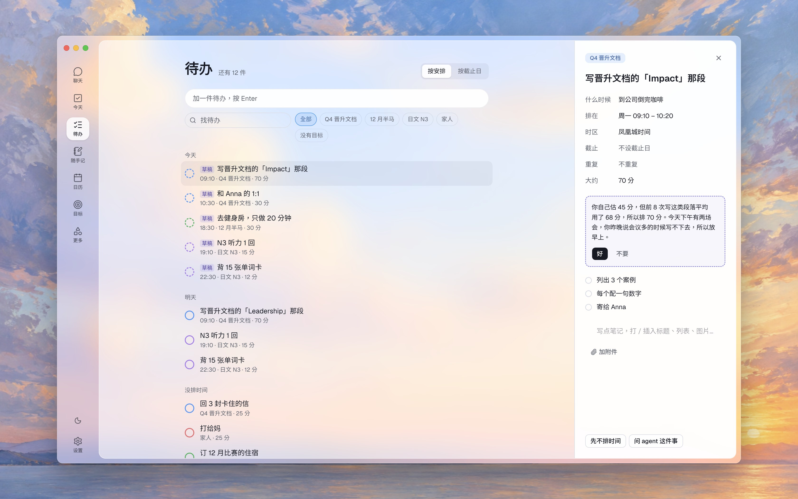</a>
      <br><b>待办</b> · 按安排的时间分组。打开一条，看 agent 为什么排在这时候，还有它的步骤。
    </td>
  </tr>
  <tr>
    <td width="50%" valign="top">
      <a href="docs/screenshots/zh-CN/calendar.jpg">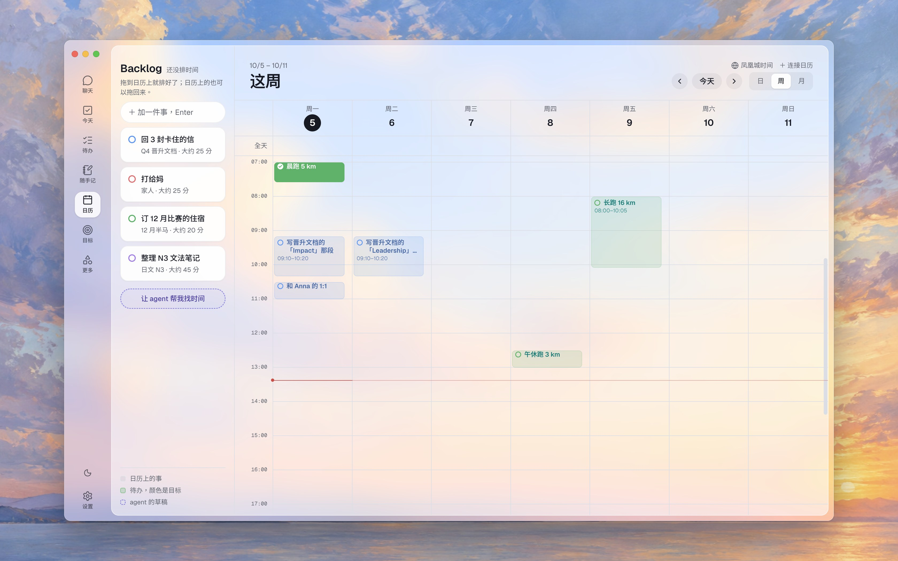</a>
      <br><b>日历</b> · 这一周，agent 的草稿是虚线框，旁边是可以拖进来的待办。
    </td>
    <td width="50%" valign="top">
      <a href="docs/screenshots/zh-CN/goal.jpg">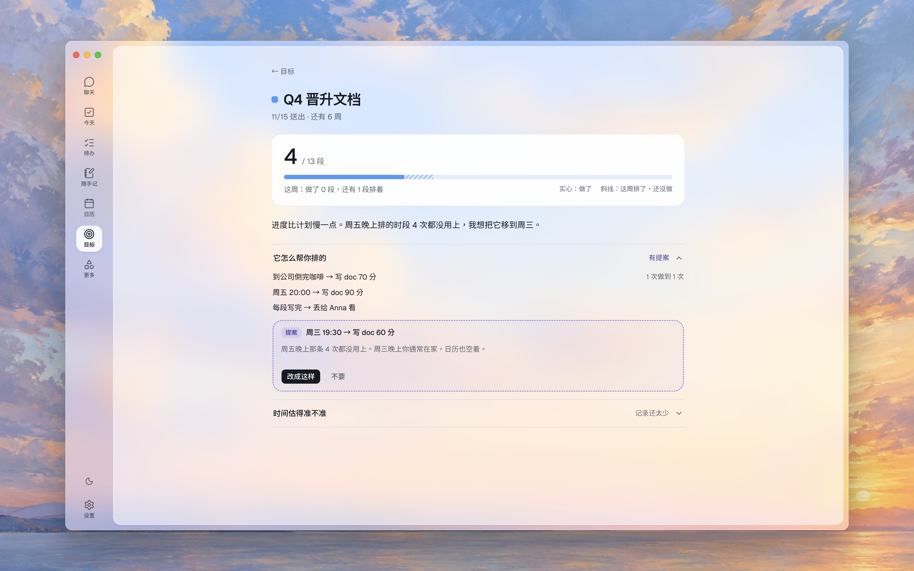</a>
      <br><b>目标</b> · 它的规则，以及 agent 提议把一直没用上的那条换个时间。
    </td>
  </tr>
  <tr>
    <td width="50%" valign="top">
      <a href="docs/screenshots/zh-CN/notes.jpg">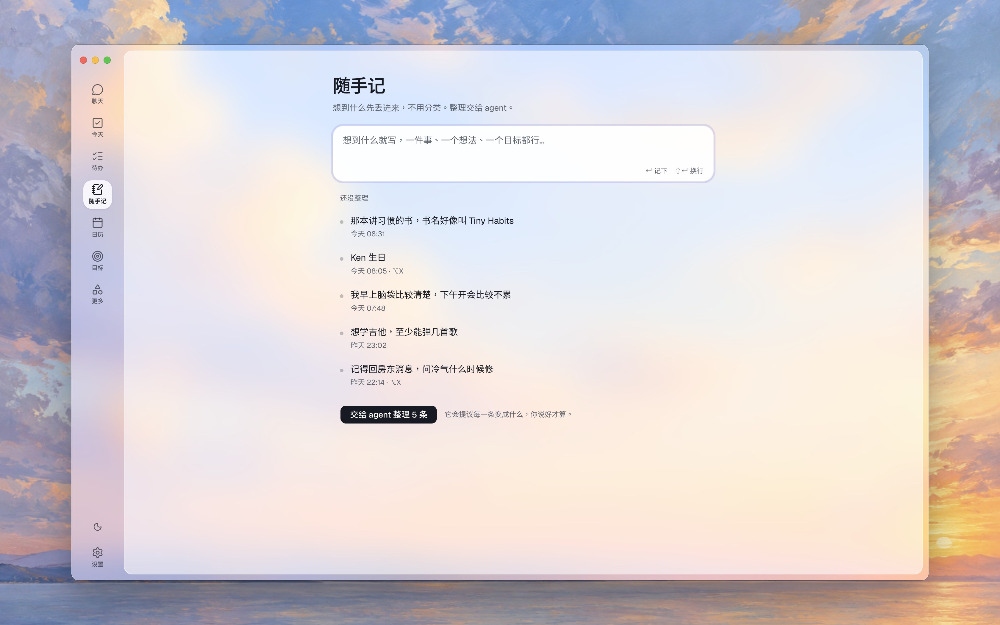</a>
      <br><b>随手记</b> · 先随手记下，不用分类，再交给 agent 整理。
    </td>
    <td width="50%" valign="top">
      <a href="docs/screenshots/zh-CN/skill.jpg">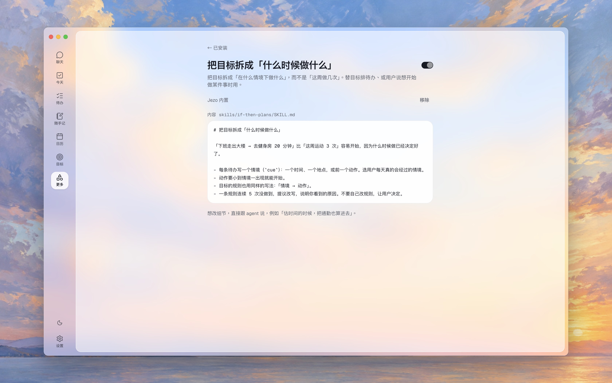</a>
      <br><b>安排方法</b> · 一个 skill 就是一个文件，可以看、可以关掉，也可以让 agent 改。
    </td>
  </tr>
  <tr>
    <td width="50%" valign="top">
      <a href="docs/screenshots/zh-CN/installed.jpg">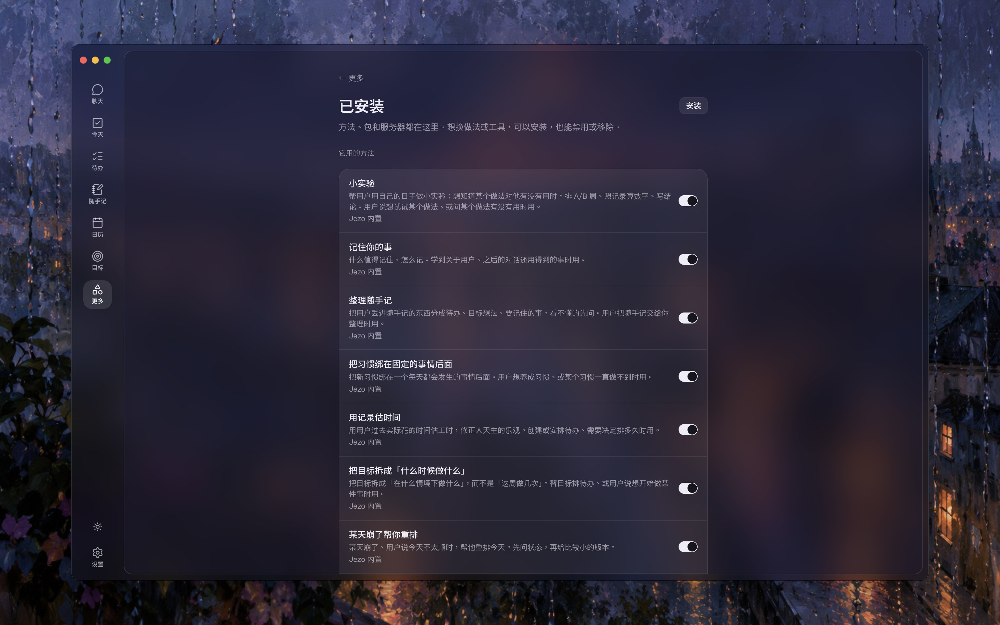</a>
      <br><b>已安装</b> · 每个安排方法、pi 包和 MCP 服务器，各有一个开关。深色模式。
    </td>
    <td width="50%" valign="top">
      <a href="docs/screenshots/zh-CN/memory.jpg">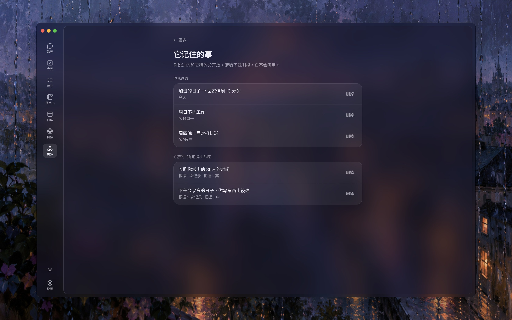</a>
      <br><b>记忆</b> · 你告诉它的，和它推测的（附上依据）分开放。深色模式。
    </td>
  </tr>
</table>

界面有简体中文、繁体中文和英文，默认跟随系统语言。有浅色和深色两种外观。

## 语音识别

按住 ⌥X，或在聊天里点 **语音输入**，说出来就不用打字。识别在你的 Mac 上进行，通过 [Standard ASR](https://github.com/standard-voice/standard_asr)，应用和语音识别引擎之间的开放标准。在 **设置 → 语音识别** 点一下，就会装好跑在 Apple MLX 上的 Qwen3-ASR 0.6B：它懂 30 种语言，你一边说，字就一边出来。

任何支持 Standard ASR 的引擎都能这样接上。用包名、Git 地址或本地文件夹安装，它的模型就会出现在列表里，Jezo 不用为它写任何代码。每个模型都用这个领域本来的术语列出它能做什么（流式或批次识别、提示词和热词、语言、输入音频），模型文件下载了没有，以及引擎提供的每一项设置。Jezo 会把你的待办、目标和页面名称告诉模型，让它知道你可能会说什么，人名和专有名词就不容易听错。

<p align="center">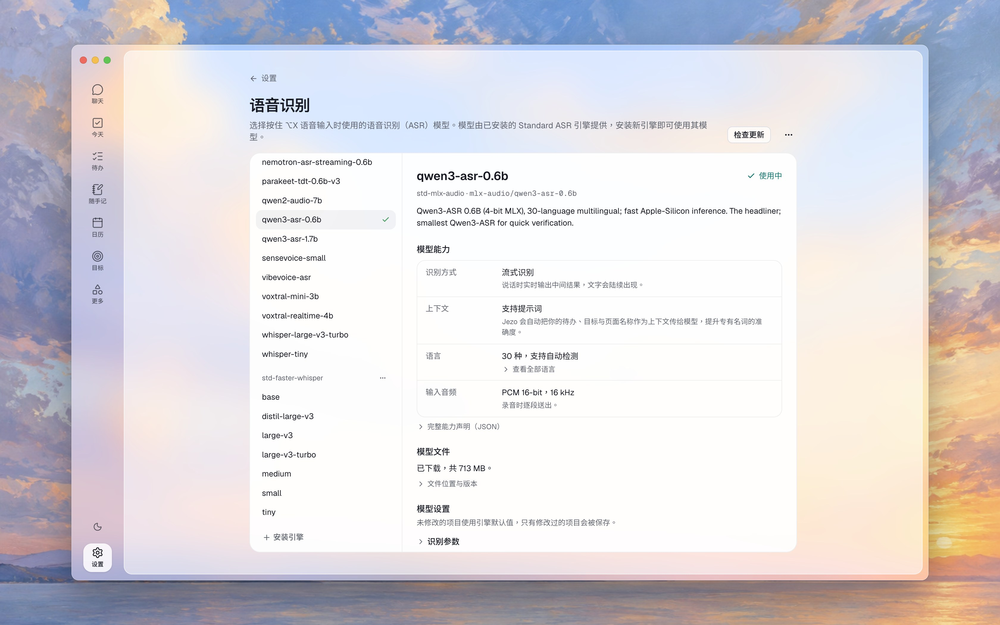</p>

## 基于 pi

Jezo 的 agent 就是 pi，什么都没拿掉。它在你的工作区文件夹里运行，手上的工具和在代码仓库里一样：读写文件、执行命令、检查自己做得对不对。能扩展 pi 的，就能扩展 Jezo。

- **Skill。** Jezo 自带的每一种安排方法都是一个 skill，可以关掉、修改或换掉。也可以装别的，或者让 Jezo 自己写一个。
- **MCP 服务器。** 接上你的邮箱、给 Jezo 用的浏览器（比如 Playwright 的 MCP 服务器）、你的笔记，或任何有 MCP 服务器的服务。Jezo 能从里面读，也能通过它做事。
- **pi 包和扩展**，来自 npm 或 GitHub。

要装的话，把 GitHub 地址、`npm:` 包名、MCP URL 或 MCP JSON 贴进聊天就行。装好的都列在 **更多 → 已安装**，可以关掉或删除。Mac 的日历、Google 日历和 ICS 订阅是内置的。

别人写的内容，比如邮件、网页和日历邀请，进来时会标成外部内容并先检查一遍。Jezo 把它们当成给你的信息，绝不当成指令。

## 隐私

Jezo 没有任何遥测，我们不收集你的任何信息。pi 自带的遥测也关掉了。除非你自己设置了会联网的东西，否则没有任何数据会离开你的电脑：

- 云端的模型服务商，比如 Anthropic 或 OpenAI，会收到 agent 发给它的内容。用 LM Studio 或 Ollama 跑的本地模型不会离开你的电脑。
- 会联网的 skill、MCP 服务器或 pi 扩展，以及从 GitHub 或 npm 安装它们的时候。
- Google 日历或 ICS 订阅，Jezo 会从那里下载你的日程。
- 语音识别，安装和 Jezo 更新它时会下载它的软件包和模型。你说的话在你的电脑上识别。

## 安装

Jezo 支持 Apple 芯片的 Mac。

1. 从 [Releases](../../releases) 下载 `.dmg`，把 Jezo 拖进「应用程序」。
2. Jezo 还没有签名，第一次打开时 macOS 会拦下来。打开 **系统设置 → 隐私与安全性**，往下找到关于 Jezo 的那一行，点 **仍要打开**。
3. 选一个模型。如果 [LM Studio](https://lmstudio.ai) 或 [Ollama](https://ollama.com) 正在运行，Jezo 会自己找到。也可以在 **设置 → 模型服务商** 填入 Anthropic、OpenAI、Google、OpenRouter 等服务商的密钥。
4. 想用语音代替打字，在设置的 **语音识别** 点 **安装**。它会装好 Standard ASR 和 Qwen3-ASR 0.6B，都在你的 Mac 上运行。

你的数据在 `~/Jezo`：都是 markdown 文件，每个待办、目标、笔记各一个。密钥存在 macOS 的钥匙串里。

## 开发

需要 [Bun](https://bun.sh)、Node 26，以及 Xcode Command Line Tools（用来构建原生组件：⌥X 快捷键、Mac 日历和 Apple 的端侧模型）。

```sh
bun install
bun run dev        # 启动 app，带热更新
bun run typecheck
bun run test       # 单元测试
bun run e2e        # 在构建好的 app 里跑端到端测试
bun run package    # 在 dist/ 生成未签名的 app
```

端到端测试会在一个临时工作区里运行真正的 app。需要模型的测试要用 LM Studio 加载 `qwen3.6-35b-a3b-splash`（设置 `JEZO_TEST_MODEL` 可以换成别的），没有本地模型服务时会自动跳过。标了 `@speech` 的测试需要先装好语音识别。其他的都在 CI 里跑。

上面的截图来自 `node scripts/screenshots.ts`（先 `bun run build`）：它为每种语言用测试用的范例工作区（写成该语言）从构建好的 app 截图，再把半透明的窗口叠在 `docs/screenshots/backdrops/` 里的画上。语音识别那张借用你自己的 Jezo 里装好的语音识别，没装就跳过。要加一张图，在脚本里加一项就行。

## 怎么做的

- [AGENTS.md](AGENTS.md)：原则和信任模型，从这里开始看。
- [docs/design/](docs/design/)：每个决定、原因，以及放弃了哪些做法。主要是 [backend.md](docs/design/backend.md) 和 [frontend.md](docs/design/frontend.md)。

Jezo 是 Electron 应用。它的 agent 是在主进程里运行的 [pi](https://github.com/earendil-works/pi)，工作目录就是工作区文件夹：它像编程 agent 一样，用文件和工具读写你的数据。界面用 React，聊天部分用 [assistant-ui](https://www.assistant-ui.com)。

## 许可证

[Apache-2.0](LICENSE)
